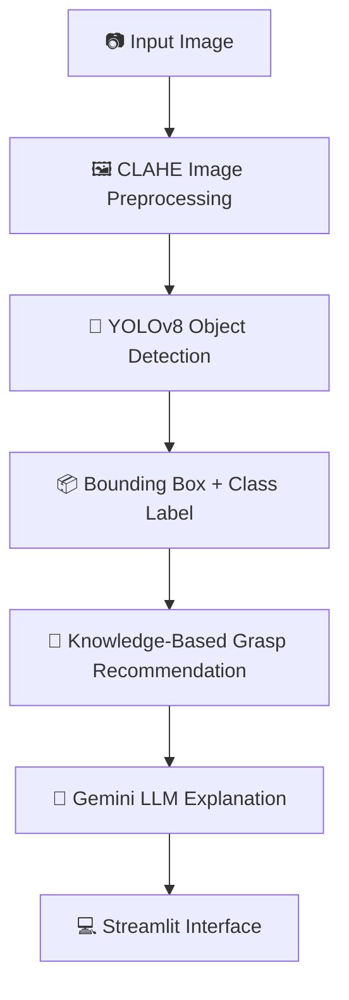
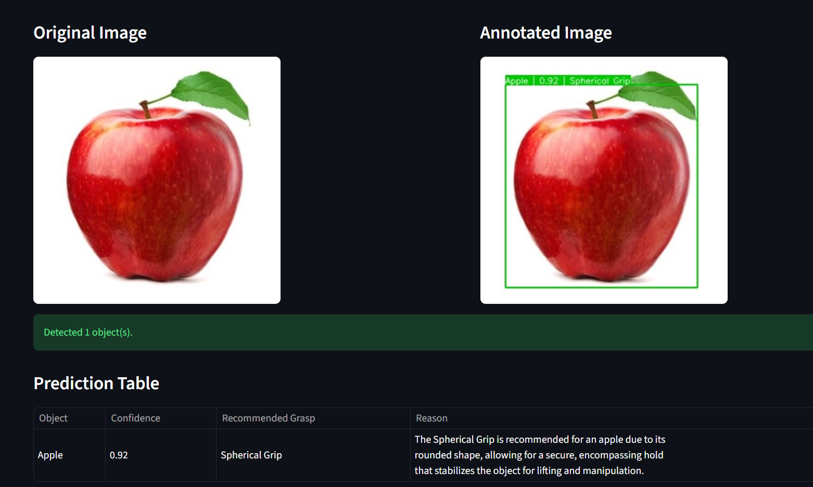
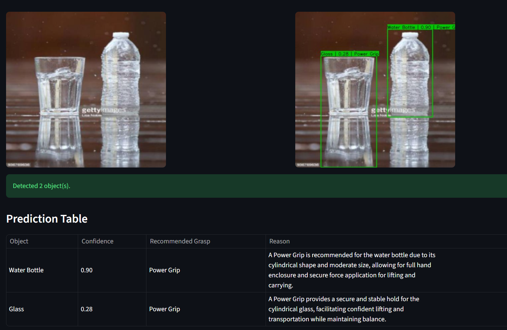
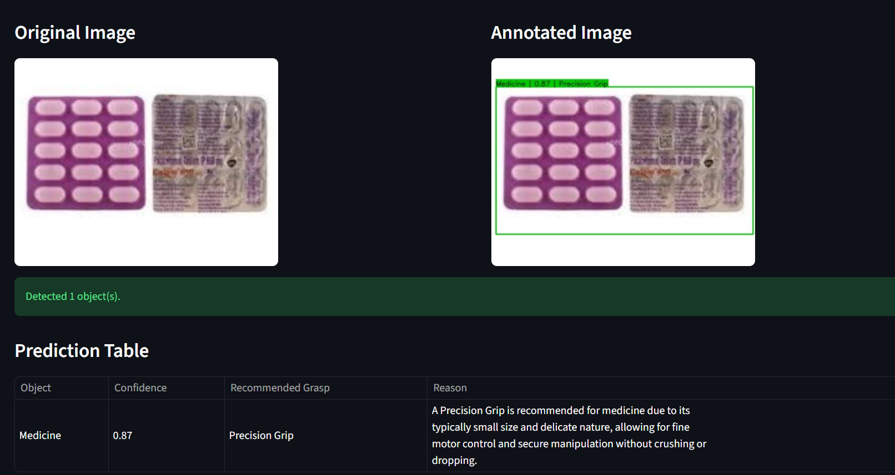

# 🦾 Prosthetic Hand Grasp Recommendation using YOLOv8 
---

## 📖 Overview

**Prosthetic Hand Grasp Recommendation using YOLOv8** is a computer vision project that combines **deep learning**, **rule-based reasoning**, and **large language models (LLMs)** to recommend appropriate prosthetic hand grasps for everyday household objects.

The system detects objects using a **custom-trained YOLOv8 model**, enhances image quality through **CLAHE preprocessing**, recommends an appropriate prosthetic grasp using a **knowledge-based grasp engine**, and finally generates a human-readable explanation using **Google Gemini**.

---

# ✨ Features

- 🎯 Custom-trained YOLOv8 object detector
- 🖼️ CLAHE-based image preprocessing
- 📦 Multi-object detection
- 📊 Confidence score visualization
- 🦾 Rule-based prosthetic grasp recommendation
- 🤖 Gemini-generated explanation for every recommendation
- 💻 Interactive Streamlit web interface

---

# 🛠 Tech Stack

| Category | Technology |
|------------|------------|
| Language | Python |
| Object Detection | YOLOv8 (Ultralytics) |
| Computer Vision | OpenCV |
| Image Processing | Pillow |
| Numerical Computing | NumPy |
| Web App | Streamlit |
| LLM | Google Gemini API |

---

# 📂 Dataset

The object detector was trained on a custom household object detection dataset from **Roboflow Universe**.

**Dataset:** [Household Objects Detection Dataset](https://universe.roboflow.com/voiceautomatedhelpinghand-fmskv/household-objects-detection-ggloy)

### Dataset Classes

| Classes |
|----------|
| 🍎 Apple |
| 🍌 Banana |
| ☕ Cup |
| 🥛 Glass |
| 💊 Medicine |
| 🍊 Orange |
| 📺 Remote |
| 🚰 Water Bottle |

---

# ⚙️ Training Configuration

| Parameter | Value |
|------------|--------|
| Model | YOLOv8n |
| Epochs | 50 |
| Image Size | 640 × 640 |
| Batch Size | 16 |
| Early Stopping Patience | 10 |
| Augmentation | Enabled |

---

# 📈 Performance

## Overall Performance

| Metric | Value |
|----------|---------|
| Precision | **94.1%** |
| Recall | **94.8%** |
| mAP@50 | **96.5%** |
| mAP@50-95 | **83.9%** |

---

## Per-Class Performance

| Class | Precision | Recall | mAP@50 |
|--------|----------|--------|---------|
| Apple | 95.5% | 100% | 99.5% |
| Banana | 98.5% | 100% | 99.5% |
| Cup | 94.6% | 86.4% | 91.6% |
| Glass | 77.3% | 86.1% | 86.6% |
| Medicine | 93.8% | 100% | 99.5% |
| Orange | 98.7% | 100% | 99.5% |
| Remote | 100% | 93.5% | 99.3% |
| Water Bottle | 94.3% | 92.3% | 96.5% |

---

# 📁 Repository Structure

```text
PROSTHETIC-GRASP-AI
│
├── models/
│   └── best.pt                 # Trained YOLOv8 model
│
├── images/
│   ├── 1.png
│   ├── 2.png
│   └── 3.png                   # Sample outputs
│
├── app.py                      # Streamlit application
├── detector.py                 # YOLO inference
├── preprocess.py               # CLAHE preprocessing
├── annotator.py                # Bounding box visualization
├── grasp_engine.py             # Rule-based grasp recommendation
├── llm_reasoner.py             # Gemini reasoning
├── config.py                   # Project configuration
├── requirements.txt            # Dependencies
├── .env.example                # API key template
├── README.md
└── .gitignore
```

---

# 🔄 Project Pipeline



---

# 🧠 Prosthetic Grasp Recommendation

After object detection, each object class is mapped to an appropriate prosthetic grasp using a knowledge-based rule engine.

| Object | Recommended Grasp |
|----------|-------------------|
| Apple | Spherical Grip |
| Banana | Power Grip |
| Cup | Power Grip |
| Glass | Cylindrical Grip |
| Medicine | Precision Grip |
| Orange | Spherical Grip |
| Remote | Lateral Grip |
| Water Bottle | Cylindrical Grip |

Google Gemini then generates a concise explanation describing why the selected grasp is appropriate based on the object's characteristics.

---

# 🚀 Installation

## 1. Clone the Repository

```bash
git clone https://github.com/shreya-ramesh/PROSTHETIC-GRASP-AI.git

cd PROSTHETIC-GRASP-AI
```

---

## 2. Create a Virtual Environment

### Windows

```bash
python -m venv venv

venv\Scripts\activate
```

### macOS / Linux

```bash
python -m venv venv

source venv/bin/activate
```

---

## 3. Install Dependencies

```bash
pip install -r requirements.txt
```

---

## 4. Configure Gemini API

Create a `.env` file in the project root.

```env
GEMINI_API_KEY=YOUR_API_KEY
```

---

## 5. Launch the Application

```bash
streamlit run app.py
```

---

# 🖼️ Sample Results

### Example 1



---

### Example 2



---

### Example 3



---
# ⚠️ Challenges

- Similar-looking household objects occasionally resulted in false detections.
- Transparent glass objects were more challenging to detect due to limited visual features.
- Object detection alone cannot infer grasp affordances, such as distinguishing between cups with and without handles.
- Designing a generalized grasp recommendation system beyond a small set of known objects remains challenging.
- Processing multiple detected objects requires generating separate grasp recommendations and explanations for each object.

---

# ✅ Solutions

- Fine-tuned a custom YOLOv8 model on a household object dataset to improve detection performance.
- Applied CLAHE preprocessing to enhance image contrast before inference.
- Developed a modular rule-based grasp recommendation engine for the supported object classes.
- Integrated Google Gemini to generate clear, human-readable explanations for each recommended grasp.
- Designed a modular architecture that can be extended with affordance detection and learning-based grasp prediction in the future.

---

# 🚀 Future Improvements

- Replace rule-based mapping with affordance-based grasp prediction.
- Detect object handles and other grasp-specific features.
- Incorporate shape and material estimation.
- Integrate depth estimation using RGB-D cameras.
- Support real-time webcam inference.
- Optimize inference using TensorRT for edge deployment.
- Deploy on embedded platforms such as NVIDIA Jetson or Raspberry Pi AI Kit.
- Integrate with ROS2 for robotic and prosthetic communication.
- Support multi-object grasp planning in complex scenes.
